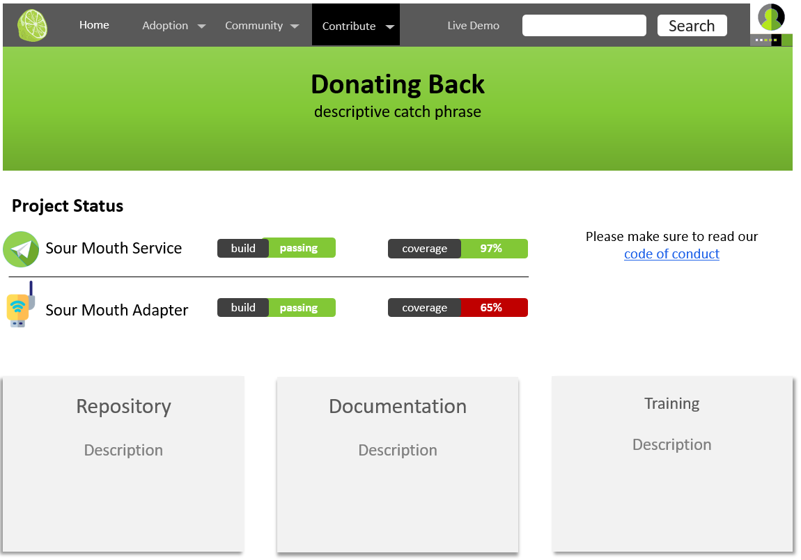

### Testing Strategy & Standards

> This is where you would link to your source code repository. 
> NOTE: Make sure developers have everything they need for development available in the repo (or link to the contribution website - see example below)

> Read more about building a testing strategy [here](https://www.softwaretestinghelp.com/writing-test-strategy-document-template/)

#### Example
